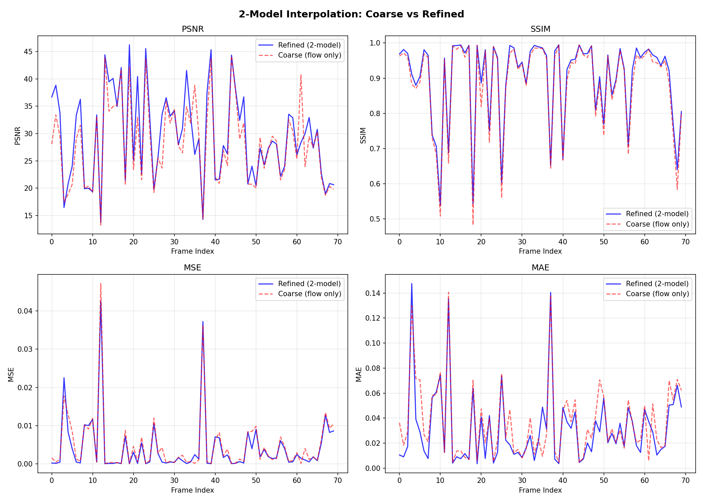

# Satellite Frame Interpolation — ISRO Hackathon

> **Deep-learning pipeline for enhancing temporal resolution of geostationary satellite imagery.**  
> A 2-stage coarse-to-refined architecture for high-fidelity cloud motion synthesis in severe weather tracking.

---

## Results

Validated on **70 unseen test triplets**.

| Metric | Model 1 (Coarse) | Model 1 + 2 (Refined) | Gain |
|:-------|:----------------:|:---------------------:|:----:|
| SSIM ↑ | 0.886            | **0.900**             | +0.014 |
| PSNR ↑ | 28.18 dB         | **29.59 dB**          | +1.41 dB |
| MSE ↓  | 0.0047           | **0.0042**            | −10.6% |
| MAE ↓  | 0.0368           | **0.0316**            | −14.1% |

---

## Architecture

Sequential refinement pipeline to minimize motion artifacts:

```
Frame t₀ ──┐
            ├──▶  Model 1: IFNet  ──▶  Coarse Frame  ──▶  Model 2: RefinementNet  ──▶  Final Frame
Frame t₁ ──┘
```

- **Model 1 — IFNet**: Optical flow estimation + coarse intermediate frame synthesis.
- **Model 2 — RefinementNet**: U-Net with CBAM attention; corrects residual artifacts in the coarse output.

---

## Training

Three-stage pipeline. Each stage builds on the previous.

| Stage | Focus                   | LR    | Epochs | Status   |
|:-----:|:------------------------|:-----:|:------:|:--------:|
| 1     | Optical Flow Training   | 1e-4  | 100    | ✅ Done  |
| 2     | Refinement Network      | 2e-4  | 50     | ✅ Done  |
| 3     | End-to-End Fine-tuning  | 1e-5  | 50     | ✅ Done  |

---

## Repository

```
├── models/
│   ├── ifnet.py              # IFNet optical flow architecture
│   └── refinement_unet.py    # U-Net + CBAM refinement network
├── scripts/
│   ├── ingest.py             # AWS S3 data ingestion
│   └── preprocess.py         # Normalization and augmentation
├── assets/
│   └── metrics_comparison.png
├── evaluate.py               # SSIM/PSNR/MSE/MAE evaluation suite
└── satellite_frame_interpolation.ipynb  # Full training + eval notebook
```

---

## Quick Start

1. Open the notebook: **[Launch in Colab](YOUR_NOTEBOOK_LINK_HERE)**
2. Set runtime to **T4 GPU** (`Runtime → Change runtime type`)
3. **Run All** — paths and checkpoints are pre-configured

---

## Demo

