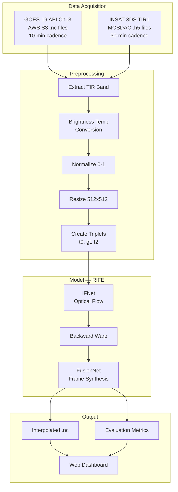
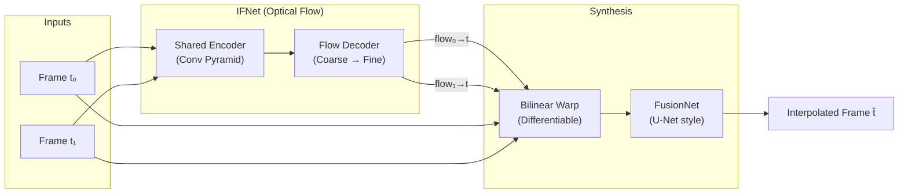

# ISRO Hackathon: Satellite Frame Interpolation — Implementation Plan

## Resources Summary

### Insatinator Repo (Inspiration)
The [insatinator](https://github.com/zeroby0/insatinator) repo shows how to process INSAT-3D HDF5 files:
- **Bands**: `IMG_MIR`, `IMG_SWIR`, `IMG_TIR1`, `IMG_TIR2`, `IMG_VIS`, `IMG_WV`
- **Variants**: `ALBEDO`, `RADIANCE`, `TEMP`
- **Pipeline**: Read H5 → Extract band LUT → Normalize to 0-255 → Resize (SWIR/VIS upscaled to 2816×2805) → Save as numpy/PNG
- **Key technique**: Uses lookup-table (LUT) mapping — `hdf[band]` contains indices, `hdf[band_VARIANT]` contains the LUT values

### Google Drive Data
The shared [Google Drive folder](https://drive.google.com/drive/folders/1v3mfZYFUX7YUrjKcxvKz_RkJxAcNGu5-) contains:

| Folder | Contents | Count |
|--------|----------|-------|
| **Still/** | PNG images of all bands (SWIR, MIR, VIS, TIR1, TIR2) | 60 files (~7-8 MB each) |
| **Timelapse/** | MKV videos of band animations | 60 files (~10-15 MB each) |
| **Root** | Full-globe RGB composites (1x1, 4x4, 8x8) | 4 files |

> [!IMPORTANT]
> The Google Drive **Still images are pre-rendered PNGs**, not raw H5/NC files. For the hackathon, we need raw `.h5` files from MOSDAC for model input/output. The Drive data is useful for **visualization reference** and understanding band characteristics.

---

## Architecture Overview



---

## Phase 1: Data Acquisition

### 1A. GOES-19 ABI Channel 13 (Primary — for Training & Validation)

```python
# Download from public AWS S3 (no auth needed)
import s3fs

fs = s3fs.S3FileSystem(anon=True)
# Full-disk scans, Channel 13 (~10.3 μm TIR), 10-min intervals
files = fs.glob('noaa-goes19/ABI-L1b-RadF/2025/150/*/OR_ABI-L1b-RadF-M6C13_G19_*.nc')

# Download a day's worth (~144 files)
for f in files:
    fs.get(f, f'data/goes19/{Path(f).name}')
```

### 1B. INSAT-3DS TIR1 (for Final Application — Step 4)

Following insatinator's approach:
1. Create MOSDAC account at https://www.mosdac.gov.in/
2. Order → Archived Data → Satellite → INSAT-3DS, Imager
3. Select `3SIMG_L1B_STD`, TIR1 band, HDF format
4. Download `.h5` files to `data/insat3ds/`

---

## Phase 2: Preprocessing Pipeline

### 2A. GOES-19 NetCDF Processing

```python
import xarray as xr
import numpy as np
from PIL import Image

def preprocess_goes19(nc_path, output_size=512):
    """Extract brightness temperature from GOES-19 Ch13 .nc file"""
    ds = xr.open_dataset(nc_path)
    rad = ds['Rad'].values  # Radiance array

    # Convert radiance → brightness temperature (Planck function)
    fk1 = ds['planck_fk1'].values
    fk2 = ds['planck_fk2'].values
    bc1 = ds['planck_bc1'].values
    bc2 = ds['planck_bc2'].values
    Tb = (fk2 / np.log((fk1 / rad) + 1) - bc1) / bc2

    # Normalize to [0, 1] — physical range 180-330K
    Tb = np.clip(Tb, 180, 330)
    Tb_norm = (Tb - 180.0) / (330.0 - 180.0)

    # Resize
    img = Image.fromarray((Tb_norm * 255).astype(np.uint8))
    img = img.resize((output_size, output_size), Image.BICUBIC)
    return np.array(img).astype(np.float32) / 255.0
```

### 2B. INSAT-3DS H5 Processing (Inspired by insatinator)

```python
import h5py
import numpy as np
from skimage.transform import resize

def preprocess_insat3ds(h5_path, output_size=512):
    """Extract TIR1 brightness temperature from INSAT-3DS .h5 file
    Uses insatinator's LUT-based approach"""
    with h5py.File(h5_path, 'r') as f:
        # Index array — contains pixel-level band indices
        indices = np.array(f['IMG_TIR1'][0])

        # Temperature LUT — maps indices → brightness temperature
        temp_lut = np.array(f['IMG_TIR1_TEMP'])

        # Apply LUT mapping (insatinator technique)
        Tb = temp_lut[indices]

        # Normalize to [0, 1]
        Tb_norm = Tb - Tb.min()
        Tb_norm = Tb_norm / Tb_norm.max()

        # Resize to uniform training size
        Tb_resized = resize(Tb_norm, (output_size, output_size),
                           anti_aliasing=True)
    return Tb_resized.astype(np.float32)
```

### 2C. Create Training Triplets

```python
def create_triplets(frame_paths, stride=2):
    """
    For GOES-19 (10-min cadence):
    - Input: frames at t0, t2 (20 min apart, stride=2)
    - Ground truth: frame at t1 (middle frame, 10 min)

    This simulates INSAT-3DS scenario:
    - Input: frames 30 min apart → predict 15 min middle
    """
    triplets = []
    for i in range(0, len(frame_paths) - stride, 1):
        triplets.append({
            'frame0': frame_paths[i],           # t = 0 min
            'gt':     frame_paths[i + stride//2], # t = 10 min (ground truth)
            'frame1': frame_paths[i + stride],   # t = 20 min
        })
    return triplets
```

---

## Phase 3: Model Architecture — RIFE

### Why RIFE?
| Factor | RIFE | Super SloMo |
|--------|------|-------------|
| Speed | ~30 FPS on GPU | ~5 FPS |
| Parameters | ~10M | ~40M |
| Recursive interp | Native support | Complex |
| Pre-trained weights | Available | Available |
| Fine-tuning ease | Simple | Moderate |

### Architecture Components



### Key Files to Implement

```
satellite-frame-interpolation/
├── data/
│   ├── goes19/              # Raw .nc files
│   ├── insat3ds/             # Raw .h5 files
│   └── processed/           # Preprocessed numpy arrays
│       ├── train/
│       ├── val/
│       └── test/
├── models/
│   ├── __init__.py
│   ├── IFNet.py             # Optical flow estimation network
│   ├── FusionNet.py         # Frame synthesis + refinement
│   ├── warplayer.py         # Differentiable backward warping
│   └── rife.py              # Main RIFE model combining IFNet + FusionNet
├── scripts/
│   ├── download_goes19.py   # Download data from AWS
│   ├── preprocess.py        # Preprocessing pipeline (inspired by insatinator)
│   └── create_triplets.py   # Create train/val/test splits
├── train.py                 # Training loop
├── inference.py             # Single & recursive interpolation
├── evaluate.py              # Metrics computation
├── dashboard/               # Web visualization
│   ├── index.html
│   ├── style.css
│   └── app.js
├── requirements.txt
└── README.md
```

---

## Phase 4: Training

### Loss Functions

```python
# L_total = λ₁·L_recon + λ₂·L_perceptual + λ₃·L_smooth

# Reconstruction: L1 + SSIM
L_recon = L1(pred, gt) + (1 - SSIM(pred, gt))

# Perceptual: VGG feature matching
L_perceptual = MSE(VGG_features(pred), VGG_features(gt))

# Flow smoothness: total variation regularization
L_smooth = TV(optical_flow)
```

### Training Config

| Parameter | Value |
|-----------|-------|
| **Optimizer** | AdamW, lr=1e-4, cosine decay to 1e-6 |
| **Batch size** | 8-16 |
| **Epochs** | 100-200 |
| **Input size** | 256×256 (train), 512×512 (fine-tune) |
| **Augmentation** | Random crop, horizontal/vertical flip, rotation |
| **Strategy** | Pre-train on Vimeo90K → Fine-tune on GOES-19 |

---

## Phase 5: Inference — Recursive Interpolation

### Single pass: 30 min → 15 min
```
t=0:00 ──────[model]──────── t=0:30
                 ↓
             t=0:15 (generated)
```

### Recursive: 30 min → 15 min → 7.5 min
```
t=0:00 ───────────────────── t=0:30     (original pair)
         ↓
      t=0:15                             (1st interpolation)
   ↓         ↓
t=0:07:30  t=0:22:30                    (2nd interpolation)
```

```python
def recursive_interpolate(model, f0, f1, depth=2):
    """Recursively double temporal resolution"""
    if depth == 0:
        return []
    mid = model.inference(f0, f1, t=0.5)
    left = recursive_interpolate(model, f0, mid, depth - 1)
    right = recursive_interpolate(model, mid, f1, depth - 1)
    return left + [mid] + right

# Input/Output as .nc files
def save_interpolated_nc(frame, metadata, output_path):
    ds = xr.Dataset({'brightness_temperature': (['y','x'], frame)},
                    attrs=metadata)
    ds.to_netcdf(output_path)
```

---

## Phase 6: Evaluation Metrics

| Metric | Library | Measures |
|--------|---------|----------|
| **PSNR** | `skimage.metrics` | Pixel-level accuracy (higher = better) |
| **SSIM** | `skimage.metrics` | Structural similarity (higher = better) |
| **MSE** | `numpy` | Mean squared error (lower = better) |
| **FSIM** | `piq` | Feature similarity (higher = better) |
| **LPIPS** | `lpips` | Perceptual distance (lower = better) |

### Validation Protocol
1. Take GOES-19 frames at `t₀` and `t₂` (20 min apart)
2. Interpolate `t₁` (10 min)
3. Compare against real `t₁` frame (ground truth)
4. Report aggregate metrics over 100+ test triplets
5. Compare against baseline: linear blending, Farneback optical flow

---

## Phase 7: INSAT-3DS Application

1. Load INSAT-3DS TIR1 `.h5` files using insatinator-style preprocessing
2. Run the fine-tuned RIFE model
3. Generate 15-min cadence frames (1 interpolated between each pair)
4. Optionally recursive for 7.5-min cadence
5. Save outputs as `.nc` files
6. Create timelapse animations

---

## Phase 8: Web Dashboard

### Features
- **Side-by-side player**: Original 30-min vs interpolated 15-min timelapse
- **Comparison slider**: Drag overlay to compare GT vs interpolated
- **Metrics panel**: SSIM/PSNR/MSE plots per frame (Chart.js)
- **Playback controls**: Play, pause, speed, frame-by-frame step
- **Report section**: Aggregate metrics table + downloadable report

---

## Execution Plan

| Step | Task | Duration |
|------|------|----------|
| 1 | Download GOES-19 data (1-2 days), set up preprocessing | 2 days |
| 2 | Build RIFE model, load pre-trained weights | 1 day |
| 3 | Fine-tune on GOES-19 satellite data | 2-3 days |
| 4 | Evaluate metrics, iterate on model | 1-2 days |
| 5 | Download & preprocess INSAT-3DS data | 1 day |
| 6 | Apply model to INSAT-3DS, generate animations | 1 day |
| 7 | Build web dashboard | 2 days |
| 8 | Final report, polish, presentation | 1 day |

---

## Immediate Next Steps

> [!IMPORTANT]
> **To start building, I need your answers:**
> 1. **GPU access?** — Colab Pro / Kaggle / local GPU? (Needed for training)
> 2. **MOSDAC account?** — Do you have one for INSAT-3DS `.h5` download?
> 3. **Start where?** — Should I begin with:
>    - **(A)** Setting up the project structure + preprocessing pipeline
>    - **(B)** Building the RIFE model code
>    - **(C)** Building the web dashboard
>    - **(D)** All of the above in parallel
> 4. **Google Drive data** — The Drive folder has pre-rendered PNGs/MKVs (not raw H5). Should I use those PNGs as-is for initial prototyping, or focus on raw H5 files from MOSDAC?
