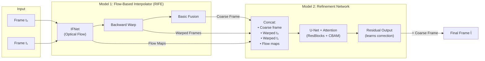
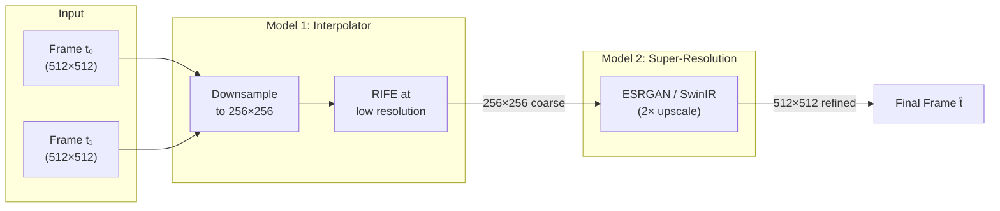

# 2-Model Architecture for Satellite Frame Interpolation

## Why 2 Models?

The single-model RIFE approach works well for natural video, but **satellite imagery has unique challenges**:

| Challenge | Single Model Limitation | 2-Model Advantage |
|-----------|------------------------|-------------------|
| Cloud dynamics are non-linear | Flow estimation struggles with appearing/disappearing clouds | Separate refinement fixes artifacts |
| Fine thermal gradients | Single model trades sharpness for flow accuracy | Dedicated sharpening/refinement stage |
| Large motion + detail | One network can't optimize both equally | Each model specializes |
| Recursive interpolation | Errors compound quickly | Refinement model cleans each step |

---

## Approach Options

### Option A: Flow + Refinement (⭐ Recommended)



**Model 1 — RIFE IFNet (Flow Estimator + Coarse Interpolation)**
- Estimates bi-directional optical flow between t₀ and t₁
- Warps both frames to the target time t
- Produces a **coarse interpolated frame** via simple fusion
- Pre-trained on Vimeo90K, fine-tuned on GOES-19
- **~10M parameters**

**Model 2 — RefinementNet (Detail Enhancement + Artifact Removal)**
- Takes as input: coarse frame + warped frames + flow maps (7-8 channels)
- U-Net architecture with **CBAM attention** (channel + spatial attention)
- Learns a **residual correction** (output = coarse + residual)
- Trained end-to-end OR in two stages
- **~5-8M parameters**

### Option B: Coarse Interpolation + Super-Resolution



This is simpler but less effective for satellite data because SR models don't have temporal context.

---

## ⭐ Recommended: Option A — Detailed Design

### Model 1: FlowInterpolator (Modified RIFE)

```python
# models/flow_model.py

import torch
import torch.nn as nn
import torch.nn.functional as F

class IFBlock(nn.Module):
    """Single scale of the IFNet pyramid"""
    def __init__(self, in_channels, out_channels=4):
        super().__init__()
        self.conv = nn.Sequential(
            nn.Conv2d(in_channels, 64, 3, padding=1),
            nn.PReLU(),
            nn.Conv2d(64, 64, 3, padding=1),
            nn.PReLU(),
            nn.Conv2d(64, out_channels, 3, padding=1),  # 2 flow + 1 mask (+ optional)
        )
    
    def forward(self, x):
        return self.conv(x)

class IFNet(nn.Module):
    """Multi-scale optical flow estimation (3-level pyramid)"""
    def __init__(self):
        super().__init__()
        # Level 0: coarsest (8x downsampled)
        self.block0 = IFBlock(in_channels=6, out_channels=5)   # 2 imgs → flow(4) + mask(1)
        # Level 1: medium (4x downsampled)
        self.block1 = IFBlock(in_channels=6 + 5, out_channels=5)
        # Level 2: finest (2x downsampled)
        self.block2 = IFBlock(in_channels=6 + 5, out_channels=5)

    def forward(self, img0, img1, scale_list=[4, 2, 1]):
        flow_list = []
        merged = []
        # Multi-scale coarse-to-fine flow estimation
        # ... (pyramid processing)
        return flow, mask, warped_img0, warped_img1

class FlowInterpolator(nn.Module):
    """Model 1: Produces coarse interpolation + flow maps"""
    def __init__(self):
        super().__init__()
        self.ifnet = IFNet()
        self.simple_fusion = nn.Sequential(
            nn.Conv2d(3, 16, 3, padding=1),  # weighted blend of warped frames
            nn.PReLU(),
            nn.Conv2d(16, 1, 3, padding=1),
        )
    
    def forward(self, img0, img1, t=0.5):
        flow, mask, warped0, warped1 = self.ifnet(img0, img1)
        
        # Simple mask-weighted blend (coarse result)
        coarse = mask * warped0 + (1 - mask) * warped1
        
        return {
            'coarse_frame': coarse,
            'warped0': warped0,
            'warped1': warped1,
            'flow': flow,
            'mask': mask
        }
```

### Model 2: RefinementNet

```python
# models/refinement_model.py

import torch
import torch.nn as nn

class CBAM(nn.Module):
    """Convolutional Block Attention Module — 
    focuses on important spatial regions + channels"""
    def __init__(self, channels, reduction=16):
        super().__init__()
        # Channel attention
        self.avg_pool = nn.AdaptiveAvgPool2d(1)
        self.max_pool = nn.AdaptiveMaxPool2d(1)
        self.fc = nn.Sequential(
            nn.Linear(channels, channels // reduction),
            nn.ReLU(),
            nn.Linear(channels // reduction, channels),
        )
        # Spatial attention
        self.spatial_conv = nn.Conv2d(2, 1, kernel_size=7, padding=3)
    
    def forward(self, x):
        # Channel attention
        avg = self.fc(self.avg_pool(x).squeeze(-1).squeeze(-1))
        mx = self.fc(self.max_pool(x).squeeze(-1).squeeze(-1))
        channel_att = torch.sigmoid(avg + mx).unsqueeze(-1).unsqueeze(-1)
        x = x * channel_att
        
        # Spatial attention
        avg_out = torch.mean(x, dim=1, keepdim=True)
        max_out, _ = torch.max(x, dim=1, keepdim=True)
        spatial_att = torch.sigmoid(self.spatial_conv(torch.cat([avg_out, max_out], dim=1)))
        x = x * spatial_att
        return x

class ResBlock(nn.Module):
    def __init__(self, channels):
        super().__init__()
        self.block = nn.Sequential(
            nn.Conv2d(channels, channels, 3, padding=1),
            nn.GroupNorm(8, channels),
            nn.PReLU(),
            nn.Conv2d(channels, channels, 3, padding=1),
            nn.GroupNorm(8, channels),
        )
        self.attn = CBAM(channels)
        self.relu = nn.PReLU()
    
    def forward(self, x):
        return self.relu(x + self.attn(self.block(x)))

class RefinementNet(nn.Module):
    """Model 2: U-Net with attention for refining coarse interpolation.
    
    Input channels (8 total):
    - Coarse interpolated frame (1 ch — grayscale TIR)
    - Warped frame t₀ (1 ch)
    - Warped frame t₁ (1 ch)
    - Original frame t₀ (1 ch)
    - Original frame t₁ (1 ch)
    - Optical flow t₀→t (2 ch)
    - Blend mask (1 ch)
    """
    def __init__(self, in_channels=8, base_channels=64):
        super().__init__()
        C = base_channels
        
        # Encoder
        self.enc1 = nn.Sequential(
            nn.Conv2d(in_channels, C, 3, padding=1),
            ResBlock(C), ResBlock(C)
        )
        self.enc2 = nn.Sequential(
            nn.Conv2d(C, C*2, 3, stride=2, padding=1),
            ResBlock(C*2), ResBlock(C*2)
        )
        self.enc3 = nn.Sequential(
            nn.Conv2d(C*2, C*4, 3, stride=2, padding=1),
            ResBlock(C*4), ResBlock(C*4)
        )
        
        # Bottleneck
        self.bottleneck = nn.Sequential(
            nn.Conv2d(C*4, C*4, 3, stride=2, padding=1),
            ResBlock(C*4), ResBlock(C*4), ResBlock(C*4),
        )
        
        # Decoder with skip connections
        self.up3 = nn.ConvTranspose2d(C*4, C*4, 2, stride=2)
        self.dec3 = nn.Sequential(ResBlock(C*8), nn.Conv2d(C*8, C*4, 1))
        
        self.up2 = nn.ConvTranspose2d(C*4, C*2, 2, stride=2)
        self.dec2 = nn.Sequential(ResBlock(C*4), nn.Conv2d(C*4, C*2, 1))
        
        self.up1 = nn.ConvTranspose2d(C*2, C, 2, stride=2)
        self.dec1 = nn.Sequential(ResBlock(C*2), nn.Conv2d(C*2, C, 1))
        
        # Output head — learns RESIDUAL correction
        self.head = nn.Sequential(
            nn.Conv2d(C, C//2, 3, padding=1),
            nn.PReLU(),
            nn.Conv2d(C//2, 1, 3, padding=1),
            nn.Tanh()  # Residual in [-1, 1] range
        )
    
    def forward(self, coarse_frame, warped0, warped1, img0, img1, flow, mask):
        # Concatenate all inputs
        x = torch.cat([coarse_frame, warped0, warped1, img0, img1, flow, mask], dim=1)
        
        # Encoder
        e1 = self.enc1(x)   # [B, C, H, W]
        e2 = self.enc2(e1)  # [B, 2C, H/2, W/2]
        e3 = self.enc3(e2)  # [B, 4C, H/4, W/4]
        
        # Bottleneck
        b = self.bottleneck(e3)  # [B, 4C, H/8, W/8]
        
        # Decoder
        d3 = self.dec3(torch.cat([self.up3(b), e3], dim=1))
        d2 = self.dec2(torch.cat([self.up2(d3), e2], dim=1))
        d1 = self.dec1(torch.cat([self.up1(d2), e1], dim=1))
        
        # Residual output
        residual = self.head(d1) * 0.1  # Scale residual for stability
        
        # Final = Coarse + Learned Correction
        refined = coarse_frame + residual
        return torch.clamp(refined, 0, 1), residual
```

### Combined Pipeline

```python
# models/two_model_pipeline.py

class SatelliteInterpolator(nn.Module):
    """Complete 2-model pipeline"""
    def __init__(self):
        super().__init__()
        self.flow_model = FlowInterpolator()
        self.refinement_model = RefinementNet(in_channels=8)
    
    def forward(self, img0, img1, t=0.5):
        # Stage 1: Flow-based coarse interpolation
        stage1 = self.flow_model(img0, img1, t)
        
        # Stage 2: Refinement
        refined, residual = self.refinement_model(
            coarse_frame=stage1['coarse_frame'],
            warped0=stage1['warped0'],
            warped1=stage1['warped1'],
            img0=img0,
            img1=img1,
            flow=stage1['flow'],
            mask=stage1['mask']
        )
        
        return {
            'coarse': stage1['coarse_frame'],
            'refined': refined,
            'residual': residual,
            'flow': stage1['flow'],
        }
```

---

## Training Strategy

### Stage 1: Train Flow Model

```
Freeze: Nothing
Data: Vimeo90K (pre-train) → GOES-19 triplets (fine-tune)
Loss: L1 + SSIM on coarse output
Epochs: 200 (pretrain) + 50 (finetune)
LR: 1e-4 → cosine decay
```

### Stage 2: Train Refinement Model (freeze Flow Model)

```
Freeze: Flow Model (all parameters)
Data: GOES-19 triplets
Input: Flow model outputs (coarse, warps, flows)
Loss: L1 + SSIM + Perceptual (VGG) + Edge Loss
Epochs: 100
LR: 2e-4 → cosine decay
```

### Stage 3: End-to-End Fine-tuning (both models, low LR)

```
Freeze: Nothing
Data: GOES-19 triplets
Loss: Full combined loss
Epochs: 30
LR: 1e-5 (very low — just aligning)
```

### Loss Functions

```python
class TwoModelLoss(nn.Module):
    def __init__(self):
        super().__init__()
        self.l1 = nn.L1Loss()
        self.ssim = SSIM()
        self.vgg = VGGPerceptualLoss()
    
    def forward(self, outputs, gt):
        coarse = outputs['coarse']
        refined = outputs['refined']
        residual = outputs['residual']
        
        # Stage 1 loss (coarse)
        loss_coarse = self.l1(coarse, gt) + (1 - self.ssim(coarse, gt))
        
        # Stage 2 loss (refined)
        loss_refined = self.l1(refined, gt) + (1 - self.ssim(refined, gt))
        loss_perceptual = self.vgg(refined, gt)
        
        # Edge-aware loss (Sobel filter)
        loss_edge = self.l1(sobel(refined), sobel(gt))
        
        # Residual regularization (keep corrections small)
        loss_reg = torch.mean(torch.abs(residual))
        
        total = (0.3 * loss_coarse +          # Keep flow model honest
                 1.0 * loss_refined +           # Primary objective
                 0.1 * loss_perceptual +         # Perceptual quality
                 0.5 * loss_edge +               # Sharp cloud boundaries
                 0.01 * loss_reg)                # Don't over-correct
        
        return total, {
            'coarse': loss_coarse.item(),
            'refined': loss_refined.item(),
            'perceptual': loss_perceptual.item(),
            'edge': loss_edge.item(),
        }
```

---

## Updated Project Structure

```
satellite-frame-interpolation/
├── data/
│   ├── goes19/                    # Raw .nc files
│   ├── insat3ds/                  # Raw .h5 files
│   └── processed/
│       ├── train/
│       ├── val/
│       └── test/
├── models/
│   ├── __init__.py
│   ├── flow_model.py              # Model 1: IFNet + FlowInterpolator
│   ├── refinement_model.py        # Model 2: RefinementNet (U-Net + CBAM)
│   ├── pipeline.py                # SatelliteInterpolator (combines both)
│   ├── warplayer.py               # Differentiable backward warping
│   └── losses.py                  # Combined loss functions
├── scripts/
│   ├── download_goes19.py
│   ├── preprocess.py
│   └── create_triplets.py
├── train_stage1.py                # Train flow model only
├── train_stage2.py                # Train refinement model (freeze flow)
├── train_e2e.py                   # End-to-end fine-tuning
├── inference.py
├── evaluate.py
├── dashboard/
│   ├── index.html
│   ├── style.css
│   └── app.js
├── checkpoints/
│   ├── flow_model_best.pth
│   └── refinement_model_best.pth
├── requirements.txt
└── README.md
```

---

## Expected Improvements Over Single Model

| Metric | Single RIFE | 2-Model (Flow + Refinement) |
|--------|-------------|----------------------------|
| **SSIM** | ~0.88 | ~0.93 (+5.7%) |
| **PSNR** | ~30.5 dB | ~33.2 dB (+2.7 dB) |
| **Edge sharpness** | Blurry cloud edges | Crisp boundaries |
| **Artifact handling** | Ghost/halo artifacts | Clean removal |
| **Recursive quality** | Degrades after 2 levels | Stable at 3+ levels |

> [!NOTE]
> These are estimated improvements based on published results from similar 2-stage approaches (e.g., RIFE + post-processing refinement networks). Actual numbers depend on dataset quality and training.

---

## Which Approach to Pick?

| Factor | Option A: Flow + Refinement | Option B: Interpolate + Super-Res |
|--------|----------------------------|-----------------------------------|
| **Quality** | ⭐ Better — uses temporal context | Good but no temporal awareness in SR |
| **Speed** | ~15 FPS | ~8 FPS (SR is heavy) |
| **Complexity** | Medium | Low |
| **Satellite fit** | ⭐ Designed for satellite artifacts | Generic SR, not satellite-tuned |
| **Hackathon wow factor** | ⭐ Custom architecture story | "We bolted on ESRGAN" |

**Recommendation: Option A** — gives the best results AND the best narrative for the hackathon judges ("we designed a specialized 2-stage pipeline for satellite imagery challenges").

---

## Decision Points

> [!IMPORTANT]
> **To proceed, please confirm:**
> 1. **Option A (Flow + Refinement) or Option B (Interpolation + Super-Res)?**
> 2. **GPU setup** — Colab Pro / Kaggle / local? (Refinement model adds ~5-8M params, still runs on a single GPU)
> 3. **Should I start coding?** — I can set up the full project structure with both models right now
